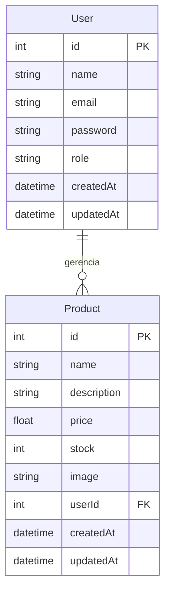

# StockMaster - um sistema de gestão de e-commerce

Sistema de gerenciamento de produtos para e-commerce, desenvolvido com Next.js, TypeScript e Prisma como parte da segunda entrega do Projeto Integrador: Análise De Soluções Integradas para Organizações para o curso de Análise e Desenvolvimento de Sistemas no Senac EAD.
O projeto oferece um painel administrativo para criar, editar, visualizar e excluir produtos, além de uma API interna para integração com a futura vitrine pública.

## Funcionalidades

- Autenticação de usuários (login/logout)
- Dashboard administrativo protegido
- CRUD completo de produtos (nome, descrição, preço, estoque, imagem)
- Validação de dados com Zod
- Persistência em banco de dados SQLite via Prisma ORM
- Interface responsiva com Tailwind CSS
- Utilização de Server Actions do Next.js para operações no servidor
- API RESTful para listagem e criação de produtos

## Tecnologias

- [Next.js 14](https://nextjs.org/) (App Router)
- [TypeScript](https://www.typescriptlang.org/)
- [Prisma ORM](https://www.prisma.io/)
- [SQLite](https://www.sqlite.org/)
- [Tailwind CSS](https://tailwindcss.com/)
- [Zod](https://zod.dev/)


## Modelagem do Banco de Dados

O banco de dados relacional é composto por duas entidades principais, `User` e `Product`, com um relacionamento de um para muitos.




Um **usuário** (vendedor ou administrador) pode gerenciar múltiplos **produtos**. A chave estrangeira `userId` na tabela `Product` estabelece esse vínculo.

## Pré-requisitos

- Node.js 18.17 ou superior
- npm ou yarn

## Configuração e Instalação

1. Clone o repositório:

   ```bash
   git clone https://github.com/MariaCaru/e-commerce-manager.git
   cd e-commerce-manager
   ```

2. Instale as dependências:

   ```bash
   npm install
   ```

3. Gere o cliente Prisma:
   ```bash
   npx prisma generate
   ```

## Executando o Projeto

Para rodar o servidor de desenvolvimento:

```bash
npm run dev
```

Acesse `http://localhost:3000/login` no navegador.

- Login admin@stockmaster.com
- Senha: 123

## Scripts Disponíveis

- `dev`: inicia o ambiente de desenvolvimento
- `build`: gera a versão de produção
- `start`: inicia o servidor em modo de produção
- `lint`: executa a verificação de código com ESLint

## Estrutura de Pastas

```
e-commerce-manager/
├── app/
│   ├── actions/         # Server Actions (productActions, etc.)
│   ├── api/
│   │   └── products/    # API Routes (REST)
│   ├── components/      # Componentes reutilizáveis
│   ├── dashboard/       # Páginas do painel administrativo
│   ├── login/           # Página de login
│   └── page.tsx         # Página inicial (vitrine)
├── lib/                 # Configuração do Prisma e utilitários
├── prisma/
│   ├── schema.prisma    # Modelo do banco de dados
│   └── dev.db           # Banco SQLite (gerado após migração)
├── public/              # Arquivos estáticos
├── utils/               # Funções auxiliares (formatação, etc.)
└── .env                 # Variáveis de ambiente
```


# Documentação Técnica: Backend e Arquitetura

Esta seção detalha a infraestrutura de dados e as funções de servidor (Server Actions) para o gerenciamento de estoque, utilizando Next.js (App Router), Prisma ORM e SQLite.

1. **Banco de Dados e Persistência**

A solução utiliza SQLite para armazenamento local, eliminando a necessidade de servidores externos na fase inicial. O esquema de dados é gerenciado via Prisma ORM e contém as seguintes entidades:

Modelo de Dados (Prisma)

    User: Armazena credenciais administrativas com e-mail único e senha.

    Product: Representa os itens do inventário, incluindo campos para Nome, Descrição, Categoria, Preço e Quantidade (Stock).

2. **Server Actions (CRUD)**

As funções de servidor residem em app/actions/productActions.ts e permitem a interação direta do Frontend com o banco de dados.

**Listagem de Produtos (getProducts)**

    Função: Recupera todos os itens do catálogo ordenados por data de criação.

    Uso: Deve ser chamada para popular o inventário no Painel de Controle.

**Cadastro de Produtos (createProduct)**

    Função: Realiza a inserção de novos itens após validação.

    Validação: Utiliza a biblioteca Zod para garantir que o nome tenha no mínimo 3 caracteres, a categoria esteja preenchida e o preço seja um valor positivo.

**Edição de Produtos (updateProduct)**

    Função: Permite a alteração de preços e informações de itens existentes.

    Aplicação: Ideal para atualizações rápidas de preços e correção de dados.

**Exclusão de Produtos (deleteProduct)**

    Função: Remove itens descontinuados do banco de dados.

    Segurança: Recomenda-se implementar modal de confirmação no Frontend antes de disparar esta ação.

3. **Validação e Integridade**

O sistema implementa uma camada de proteção dupla para garantir a integridade dos dados operacionais:

    TypeScript: Utilizado em todo o projeto para segurança de tipos e redução de erros de desenvolvimento.

    Zod Schemas: Garante que apenas dados no formato correto sejam gravados no SQLite.

4. **Utilitários de Formatação**

Para garantir a consistência visual do MVP conforme o protótipo, utilize o utilitário em utils/format.ts:

    formatCurrency(value: number): Converte valores numéricos do banco (ex: 59.9) para o formato de moeda brasileiro (ex: "R$ 59,90").

5. **Instruções de Ambiente**

    Visualização de Dados: Utilize o comando `npx prisma studio` para abrir o painel visual de gerenciamento das tabelas.

    Migrações: Qualquer alteração no arquivo schema.prisma exige a execução de `npx prisma migrate dev` para atualizar o banco local dev.db.

## Contribuidores
<div align="center"> <table> <tr> <td align="center"> <a href="https://github.com/tiaaago">  <br/> <sub><b>Tiago Enzo</b></sub> </a> </td> <td align="center"> <a href="https://github.com/darokyz">  <br/> <sub><b>Otavio Amaral</b></sub> </a> </td> <td align="center"> <a href="https://github.com/EsterHB">  <br/> <sub><b>Ester Barbosa</b></sub> </a> </td> <td align="center"> <a href="https://github.com/MariaCaru">  <br/> <sub><b>Maria Carolina</b></sub> </a> </td> <td align="center"> <a href="https://github.com/thiagolcf">  <br/> <sub><b>Thiago Lopes</b></sub> </a> </td> </tr> </table> </div>
